#    J.U.C 并发工具包

## 并发工具类分类

- 并发安全

  - 从底层原理分类
    - 互斥同步
      - 使用互斥同步锁
        - synchronized
        - ReentrantLock
        - ReadWriteLock
        - ......
      - 使用同步工具类
        - Collections.synchronizedList(new ArrayList<E>()) 等
        - Vector等
    - 非互斥同步
      - atomic原子类
    - 结合互斥和非互斥同步
      - ConcurrentHashMap集合了synchronized和CAS
      - CopyOnWriteArrayList
      - 并发队列
        - 阻塞队列
          - ArrayBlockingQueue
          - LingkedBlockingQueue
          - ......
        - 非阻塞队列
          - ConcurrentLinkedQueue
      - ConcurrentSkipListMap 和ConcurrentSkipListSet
    - 无同步方案
      - ThreadLocal
      - final
  - 从使用者角度考虑
    - 避免共享变量
      - 线程封闭 ThreadLocal
      - 栈封闭 方法内部定义变量
    - 共享变量，但加以限制
      - final关键字
      - 使用互斥同步
    - 使用成熟的工具类
      - 并发集合和队列
      - atomic包下的原子类

- 管理线程、提高效率

  - 线程池
    - Executor
    - Executors
    - ExecutorService
    - 常见线程池
      - FixedThreadPool
      - CachedThreadPool
      - ScheduledThreadPool
      - SingleThreadPool
      - ForJoinPool
      - .......
  - 获取子线程的运行结果
    - Callable
    - Future
    - FutureTask

- 为了线程之间配合，来满足业务逻辑 AQS

  - CountDownLatch
  - CyclicBarrier
  - Semaphore
  - Condition
  - Exchanger
  - Phaser
  - ......

  

## 线程池

- 线程池的自我介绍

  - 软件中的“池”，可以理解为计划经济【资源有限，只能创建10个线程】，达到线程的复用和资源的控制
  - java 中的线程是有上限的，因为cpu和内存是有限的
  - 反复创建线程的开销比较大
  - 过多的线程会占用太多的内存
  - 使用线程池的场景
    - 服务器接收请求 ，比如tomcat
    - 开发中需要创建5个以上的线程

- 创建和停止线程池

  - 创建线程池

    - 构造函数方式

      | 参数          | 类型                     | 含义                                                        |
      | ------------- | ------------------------ | ----------------------------------------------------------- |
      | corePoolSize  | int                      | 核心线程数                                                  |
      | maxPoolSize   | int                      | 最大线程数                                                  |
      | keepAliveTime | int                      | 保持存活时间                                                |
      | workQueue     | BlokingQueue             | 任务存储队列                                                |
      | threadFactory | ThreadFactory            | 当线程池需要新的线程时候，会使用threadFactory来生成新的线程 |
      | Handler       | RejectedExecutionHandler | 由于线程池也无法接受你所提交的任务的拒绝策略                |

    - 构造函数参数详解

      - corePoolSize

        - 指的是核心线程数：线程池在完成初始化之后，默认情况下，线程池中并没有任何线程，线程池会等待有任务来的时候，再创建新线程去执行任务

      - maxPoolSize

        - 线程池有可能会在核心线程数的基础上，额外增加一些线程，但是这些新增的线程也有一个上限，这就是最大量maxPoolSize

        > 如果线程数小于corePoolSize，即使其他工作线程处于空闲状态，也会创建一个新线程来完成任务
        >
        > 如果线程等于或大于corePoolSize但少于maxPoolSize，会优先放入任务队列中
        >
        > 如果队列已经满了，并且线程数小于maxPoolSize，则创建新的线程来运行任务
        >
        > 如果队列已经满了，并且线程数大于或等于maxPoolSize，则拒绝该任务

        - 图示

          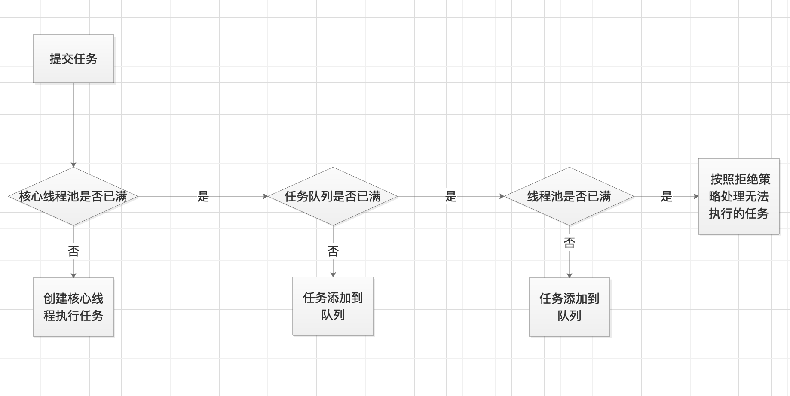

      - 增减线程池的特点

        - 通过设置corePoolSize和maxinumPoolSize相同，就可以创建固定大小的线程池
        - 线程池希望保持较少的线程数，并且只有在负载变得很大的时候才增加它
        - 通过设置maxinumPoolSize为很高的值，例如：Integer.MAX_VALUE，可以允许线程池容纳任意数量的并发任务
        - 只有队列满的时候才创建多余corePoolSize的线程，所以如果你使用的是无界队列（例如LinkedBlockingQueue），那么线程数就不会超过corePoolSize

    - keepAliveTime

      - 如果线程池当前的线程数多于corePoolSize，那么如果多余的线程空闲时间超过keepAliveTime，他们就会被终止

    - ThreadFactory

      - 新的线程由ThreadFactory创建，默认使用Executors.defaultThreadFactory()，创建出来的线程都在同一个线程组，拥有同样的NORM_PRIORITY优先级并且都不是守护线程，如果自己指定ThreadFactory,就可以改变线程名，线程组名，优先级，是否守护线程等
      
    - WorkQueue

      - 任务简单，直接交接：SynchronousQueue，没有容量
      - 无界队列：LinkedBlockingQueue
      - 有界队列：ArrayBlockingQueue

  - 手动创建和自动创建

    - 手动创建更好，可以让我们更加明确线程池的运行规则，避免资源耗尽的风险
      - 根据不同的业务场景，自己设置线程池参数，我们的内存有多大，我们想给线程取什么名字等等
    - 自动创建线程池带来的问题
      - 都有可能带来oom错误，要么是队列是无界的，要么是maxPoolSize为Integer.MAX_VALUE

  - 线程池里的数量如何设定

    - 线程池的数量应该设置为多少比较合适
      - cpu密集型（比如加密、计算hash等）
        - 最佳线程数为cpu核心数的1-2倍左右
      - 耗时IO（读取数据库、文件、网络读写等）
        - 最佳线程数一般大于cpu核心数很多倍，以JVM线程监控显示繁忙情况为依据，保证线程空闲可以衔接上，参考Brain Goetz推荐的设计算法 
          - 线程数=CPU核心数*（1 + 平均等待时间/平均工作时间）

  - 停止线程的正确方法

    - shutdown 
      - 只是告诉线程池我想要停止，如果再有任务进来就不接受了，但是原来的任务会执行完
    - isShutdown
      - 是否收到了shutdown的信号
    - isTerminated
      - 是否执行完毕了
    - awaitTermination
      - 在一段时间内是否可以停止
      - 在以下情况下返回true
        - 所有任务都执行完毕
        - 等待的时间到了
        - 等待的过程中发生错误了
    - shutdownNow
      - 立即关闭线程池，但是正在执行的线程会发送interrupt ，而等待队列直接返回

- 常见线程池特点和用法

  - FixedThreadPool
    - 线程池里的线程大小是固定的【最大和核心相等，keepAliveTime=0】，但是采用了**LinkedBlockingQueue**，如果线程的任务很耗时，可能造成oom
  - CachedThreadPool
    - 线程池的大小是0，最大为**Integer.MAX_VALUE**，**keepAliveTime=60s**，采用**SynchronousQueue**，直接交换队列，可以进行回收，但是当任务过多时，也可能造成oom
  - ScheduledThreadPool
    - 核心线程数用户给出，最大线程个数为**Integer.MAX_VALUE**，**keepAliveTime=0**，采用**DelayedWorkQueue**，定时或者周期性执行任务，也可能造成oom
  - SingleThreadPool
    - 始终只有一个线程【最大和核心相等，keepAliveTime=0】，但是采用了**LinkedBlockingQueue**，线程任务耗时的时候，也可能造成oom
  - workStealingPool  
    - 有子任务的任务采用此线程池
    - 窃取
      - 各个线程下的子线程都在自己的队列里，如果其他线程的子线程完成了本职工作，可以帮其他线程完成任务
    - 弊端
      - 不保证执行顺序，最好不加锁

- 任务太多，怎么拒绝

  - 拒绝的时机
    - 我想停止了，但是你还提交任务，我就会拒绝
    - 以及当最大线程和工作队列的容量都满了，就会拒绝
  - 拒绝策略
    - AbortPolicy：直接抛出异常
    - DiscardPolicy：默默的把任务丢弃
    - DiscardOldestPolicy：丢弃很老的任务
    - CallerRunsPolicy：谁提交任务，谁来帮我执行
      - 避免了任务丢弃
      - 降低任务提交的速度

- 钩子方法，给线程池加点料

  - 每个任务执行之前和之后做些事情

    - 日志和统计

    - 暂停线程

      ```java
      package threadpool;
      
      import jdk.nashorn.internal.ir.CallNode;
      
      import java.util.concurrent.*;
      import java.util.concurrent.locks.Condition;
      import java.util.concurrent.locks.Lock;
      import java.util.concurrent.locks.ReentrantLock;
      
      /**
       * 演示每个任务执行的前后都执行钩子函数
       */
      public class PauseableThreadPool extends ThreadPoolExecutor {
      
          private boolean isPause;
          private final Lock lcok = new ReentrantLock();
          private Condition unpaused = lcok.newCondition();
      
          public PauseableThreadPool(int corePoolSize, int maximumPoolSize, long keepAliveTime, TimeUnit unit, BlockingQueue<Runnable> workQueue) {
              super(corePoolSize, maximumPoolSize, keepAliveTime, unit, workQueue);
          }
      
          public PauseableThreadPool(int corePoolSize, int maximumPoolSize, long keepAliveTime, TimeUnit unit, BlockingQueue<Runnable> workQueue, ThreadFactory threadFactory) {
              super(corePoolSize, maximumPoolSize, keepAliveTime, unit, workQueue, threadFactory);
          }
      
          public PauseableThreadPool(int corePoolSize, int maximumPoolSize, long keepAliveTime, TimeUnit unit, BlockingQueue<Runnable> workQueue, RejectedExecutionHandler handler) {
              super(corePoolSize, maximumPoolSize, keepAliveTime, unit, workQueue, handler);
          }
      
          public PauseableThreadPool(int corePoolSize, int maximumPoolSize, long keepAliveTime, TimeUnit unit, BlockingQueue<Runnable> workQueue, ThreadFactory threadFactory, RejectedExecutionHandler handler) {
              super(corePoolSize, maximumPoolSize, keepAliveTime, unit, workQueue, threadFactory, handler);
          }
      
          @Override
          protected void beforeExecute(Thread t, Runnable r) {
              super.beforeExecute(t, r);
              lcok.lock();
              try {
                  while (isPause) {
                      unpaused.await();
                  }
              } catch (InterruptedException e) {
                  e.printStackTrace();
              } finally {
                  lcok.unlock();
              }
          }
      
          @Override
          protected void afterExecute(Runnable r, Throwable t) {
              super.afterExecute(r, t);
          }
      
          private void pause(){
              lcok.lock();
              try {
                  isPause = true;
              } catch (Exception e) {
                  e.printStackTrace();
              } finally {
                  lcok.unlock();
              }
          }
      
          public void resume(){
              lcok.lock();
              try {
                  isPause = false;
                  unpaused.signalAll();
              } catch (Exception e) {
                  e.printStackTrace();
              } finally {
                  lcok.unlock();
              }
          }
      
          public static void main(String[] args) throws InterruptedException {
              PauseableThreadPool pauseableThreadPool = new PauseableThreadPool(10, 20, 10l, TimeUnit.SECONDS, new LinkedBlockingDeque<>());
      
              Runnable r = new Runnable() {
                  @Override
                  public void run() {
                      System.out.println("我被执行了");
                      try {
                          Thread.sleep(10);
                      } catch (InterruptedException e) {
                          e.printStackTrace();
                      }
                  }
              };
              for (int i = 0; i < 10000; i++) {
                  pauseableThreadPool.execute(r);
              }
              Thread.sleep(1500);
              pauseableThreadPool.pause();
              System.out.println("线程池被暂停了");
              Thread.sleep(1500);
              System.out.println("线程池被恢复了");
              pauseableThreadPool.resume();
      
      
          }
      }
      
      ```

      

- 实现原理，源码分析

  - 线程池的组成部分

    - 线程池管理器
      - 创建线程池，停止线程池
    - 工作线程
      - 执行任务的线程
    - 任务队列
      - 存放不能及时处理的任务，必须是线程安全的队列，因为多个线程都需要去取任务
    - 任务接口（Task）
      - 线程具体执行的run方法

  - 线程池、ThreadPoolExecutor、ExecutorService、Executor、Executors等类之间的关系

    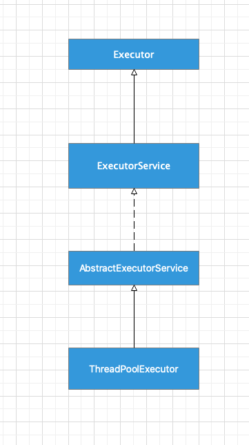

    - Executors是一个工具类

  - 线程池是如何实现线程复用的

    - 相同的线程执行不同的任务

  - 线程池的状态

    - Running
      - 接收新任务并处理排队任务
    - shutdown
      - 不接收新任务，但处理排队任务
    - stop
      - 不接收新任务，也不处理排队任务，并中断正在进行的任务
    - tidying
      - 所有的任务都已终止，workCount为0，线程会转换到TIDYING状态，并将运行teminate()钩子方法
    - terminated
      - terminate方法运行完成

- 使用线程池的注意点

  - 避免任务的堆积
  - 线程的过度增加
  - 排查线程泄漏：线程执行完毕，但是无法回收


## ThreadLocal

### 使用场景

- 每个线程需要一个独享的对象（通常是工具类，典型需要使用的类有SimpleDateFormat和Random）
  - 使用initialValue，在第一次使用get的时候就把对象初始化出来，对象的初始化时机可以由我们控制
- 每个线程内需要保存一些全局变量（例如拦截器中获取用户信息），可以让不同的方法直接使用，避免参数传递的麻烦
  - 使用set，对象的生成时机不由我们控制

### 作用

- 可以让对象在线程中隔离
- 可以在同一个线程中的任何方法都可以获取到对象


### 好处

- 线程安全
- 不需要加锁，执行效率提高
- 更高效的利用内存，节省开销
- 避免传参的麻烦


### ThreadLocal 详解

- 原理，源码解析

> - Thread、ThreadLocal、ThreadLocalMap之间的关系
>   - 每个Thread中都有一个ThreadLocalMap 成员变量，每一个ThreadLocalMap中存放多个ThreadLocal
>
> - initialValue方法
>   - 该方法会返回当前线程对应的“初始值”，这是一个延时加载的方法，只有在调用了get方法的时候，才会触发
>   - 当线程第一次调用get方法访问变量的时，将调用此方法，除非线程调用了set方法，则不会调用initialValue方法
>   - 每个线程最多调用一次initialValue方法，如果调用了remvoe方法，则需要再调用一次initialValue方法
>   - 如果不重写次方法，返回的是null，一般使用匿名内部类的方式重写initialValue方法
> - set方法
>   - 给这个线程设置一个新值
> - get方法
>   - 得到这个线程对应的value，如果是首次调用get，则会调用initialValue来得到这个值
>   - **先取出当前线程的ThreadLocalMap，然后调用map.getEntry方法，把本地ThreadLocal的引用传入，取出map中属于ThreadLocal的Value**
> - remove方法
>   - 删除线程保存的值
> - **Thread类中的ThreadLocalMap 会被以下方法初始化**
>   - ThreadLocal的set方法
>   - ThreadLocal的setInitialValue方法


-  ThreadLocal.ThreadLocalMap
  - key为ThreadLocal
  - value为自己存储的对象
  - hash冲突，java8 会变成链表，大于8 变成红黑树，但是ThreadLocalMap不是这种方式
- 两种使用场景的相同
  - 最后都是调用ThreadLocalMap色map.set()方法设置ThreadLocal和value
  - 只是入口不同，一个是set一个是initialValue

### ThreadLocal注意点

- 内存泄漏
  - 某个对象不再使用了，但是占用的内存却不能被回收
  - 发生的可能性
    - ThreadLocalMap的Entry出初始化key的初始化调用了WeakReference进行初始化，使用了弱引用，看到弱引用垃圾回收肯定会回收，但是value是强饮用
      - 如果使用了线程池，线程不会被终止，那么ThreadLocalMap就一直存在，但是key是弱引用，value是强引用，导致key 被回收，value没有被回收，此时就存在大量无用的value值
      - 但是jdk在set，remove，rehash方法中会扫描key为null的Entry，并把value设置为null，这样value也就可以被回收了，所以我们需要调用这些方法
  - **如何避免【阿里规约】**
    - 使用完了ThreadLocal，就需要调用remove方法
- 空指针异常
  - get方法不会报nullPointException，只有自己使用get后的操作会报npe
- 共享对象
  - 如果放进去的是共享对象，比如static修饰的，同样会存在线程安全问题，不应该放共享对象
- 如果不需要使用ThreadLocal就不用
- 优先使用框架的支持
  - Spring
    - RequestContextHolder
    - DateTimeContextHolder
  - http请求是一个线程，相互独立，适合用ThreadLocal


## 锁

### Lock接口

- 简介、地位和作用
  - 是一种工具，对共享资源访问进行控制
  - Lock 和 Synchronized，这是两个常见的锁，都能达到线程安全，但是使用的方法和功能上差别比较大
  - Lock并不是来代替synchronized的，而是当使用synchronized不适合或不满足要求的时候，来提供高级功能
  - Lock最长见的实现类ReentrantLock
  - 通常情况下，Lock只允许一个线程来访问这个共享资源，不过有些时候，一些特殊的实现可以允许并发访问，比如ReadWriteLock里的ReadLock
- 为什么synchronized不够用，为什么需要lock
  - synchronized 效率比较低，锁释放的情况比较少（执行代码完成），试图获得锁时不能设定超时，不能中断一个正在试图获取锁的线程
  - synchronized 不够灵活（读写锁更灵活）：加锁和释放时机单一，每个锁仅有单一的条件（某个对象），可能是不够的
  - synchronized  无法知道是否成功获取到了锁
- 方法介绍
  - 常见方法
    - lock
      - 获取锁，如果锁被其他线程获取，则进行等待
      - 和synchronzied不一样，异常时不会释放锁，必须放在finally里释放锁
      - lock方法不能被中断，这会带来很大的隐患，一旦陷入死锁，lock就会永久等待
    - trylock
      - 尝试获取锁，当前锁被其他线程占有，则获取失败返回false，没有被占有返回true
      - 相对于lock，更有优势，可以根据是否获取到锁来判定是否执行后面的代码
      - 会立刻返回，不会一直等待
    - tryLock(long time,TimeUnit unit)
      - 在一段时间内返回true 和false
    - tryInterruptibly()
      - 相当于tryLock(long time,TimeUnit unit)把超时时间设置为无限，在等待锁的过程中，线程可以被中断
    - unlock
      - 获取到锁立马写释放锁的代码
- 可见性保证
  - 和synchronized 有同样的内存模型

### 锁的分类


#### 乐观锁和悲观锁

**从线程要不要锁住同步资源来分类，乐观锁又称之为非互斥同步锁，悲观锁又称之为互斥同步锁**

- 为什么会诞生非互斥同步锁 - 互斥同步锁的劣势

  - 互斥同步锁【synchronized和Lock相关】
    - 阻塞和唤醒带来的性能的问题
    - 永久阻塞：如果持有锁的线程永久阻塞，比如遇到了死循环，死锁等活跃性问题，那么等待同一把锁的线程，也将永远得不到执行
    - 优先级反转，阻塞优先级比较高，但是拥有锁的线程优先级比较低，此时拥有锁的线程如果不释放锁，那么等锁的线程的优先级没有意义

- 什么是乐观锁和悲观锁

  - 悲观锁：操作对象之前总是先锁住操作的对象不让别的线程来操作该对象
    - synchronized和Lock相关
  - 乐观锁：
    - 认为自己处理对象的时候其他线程不会来干扰，所以不会锁住被操作的对象
    - 更新的时候，去比对我修改的期间数据有没有被其他人修改，如果没被修改过，就说明只有自己在操作，那么就正常的修改数据
    - 如果数据和我一开始拿到的不一样了，我就认为有人在修改数据，我就放弃修改，采取报错和重试的策略
    - 一般都是利用CAS算法来实现的
    - 典型例子：原子类和并发容器等

- 典型的例子

  - 乐观锁
    - 原子类和并发容器
    - git 版本管理器push的时候
    - update set num = 2,version = version + 1 where version = 1 and id =5;
  - 悲观锁
    - synchronized和Lock
    - select for update 就是悲观锁

- 开销对比

  - 悲观锁的开销要高于乐观锁，但是特点是一劳永逸，临界区持锁时间就越来越差，也不会对互斥锁的开销产生影响
  - 乐观锁一开始的开销比悲观小，但是如果自旋时间很长或者不停重试，那么消耗的资源也就随之增多

- 两种锁的使用场景

  - 悲观锁：适用于并发写入很多的情况，适用于临界区持锁时间比较长的情况，可以避免大量的无用自旋等待等消耗
    - 临界区有IO操作
    - 临界区代码复杂或者循环量很大
    - 临界区竞争非常激烈
  - 乐观锁：适合并发写入少，大部分是读取的场景，不加锁能让读取大幅度的提高性能

  

#### 可重入锁和非可重入锁【ReentrantLock 】

**同一个线程是否可以重复获取同一把锁**

- 什么叫可重入 
  - 同一个线程下可以多次获取同一把锁
- 好处
  - 避免死锁
  - 提升了封装性 
- 非不可重入
  - ThreadPoolExecutor的Worker类
- AQS的应用
- ReentrantLock的其他常用方法
  - isHeldByCurrentThread 查看锁是否被当前线程持有
  - getQueueLength 返回当前正在等待这把锁的队列有多长


#### 公平锁和非公平锁

**多线程竞争的时候是否需要排队**

- 什么是公平什么是非公平

  - 按照线程的请求的顺序，来分配锁，非公平指的是，不完全按照请求的顺序，在一定情况下可以插队
  - 非公平锁也是不提倡插队行为的，这里的非公平，指的是“在合适的时机”插队，而不是盲目插队
  - 什么是合适时机
    - 买火车票插队 
      - 以前是线下排队，比如排在我前面的还有一个人，买好票走了，轮到我了，我熬夜后有点懵一时没反应过来，这个时候有个人来问了下火车几点开，但是他没有买票就走了，其实没有影响我买到票

- 为什么有非公平的存在

  - 避免线程在阻塞切换到唤醒的过程的得到利用，比如A线程拿到锁，B线程在阻塞状态等待锁，此时A释放了锁，又一个C线程在执行过程中需要获取锁，B在醒来过程中准备抢锁，这个时候是准许C先抢到锁的，达到双赢

- ReentrantLock的公平情况

  - 默认是**非公平锁**，在创建的时候传入true 就是公平锁
  - 按照排队队列来分配锁

- ReentrantLock的非公平情况

  - 排队的队列中的线程，和还没有进入到队列中的线程同时抢锁，此时会先给没有进入队列线程分配锁，此时就是公平锁

- 代码案例，演示公平和非公平

  ```java
  package lock.reentrantlock;
  
  import java.util.Random;
  import java.util.concurrent.locks.Lock;
  import java.util.concurrent.locks.ReentrantLock;
  
  /**
   * 演示公平和非公平锁
   */
  public class FairLock {
  
  
  
      public static void main(String[] args) {
          PrintQueue printQueue = new PrintQueue();
          Thread thread[] = new Thread[10];
          for (int i = 0; i < 10; i++) {
              thread[i] = new Thread(new Job(printQueue));
          }
  
          for (int i = 0; i < 10; i++) {
              thread[i].start();
              try {
                  Thread.sleep(100);
              } catch (InterruptedException e) {
                  e.printStackTrace();
              }
          }
      }
  }
  
  class Job implements Runnable {
      private PrintQueue printQueue;
  
      public Job(PrintQueue printQueue) {
          this.printQueue = printQueue;
      }
  
      @Override
      public void run() {
          System.out.println(Thread.currentThread().getName() + "开始打印");
          printQueue.printJob(new Object());
          System.out.println(Thread.currentThread().getName() + "打印完毕");
      }
  }
  
  class PrintQueue{
  //    private Lock queueLock = new ReentrantLock(true); // 公平
  
      private Lock queueLock = new ReentrantLock(false); // 非公平
  
      public void printJob(Object document) {
          queueLock.lock();
          try {
              int duration =  new Random().nextInt(10) + 1;
              System.out.println(Thread.currentThread().getName() + "正在打印，需要" + duration + "秒");
              Thread.sleep(duration*1000);
          } catch (InterruptedException e) {
              e.printStackTrace();
          } finally {
              queueLock.unlock();
          }
          queueLock.lock();
          try {
              int duration =  new Random().nextInt(10) + 1;
              System.out.println(Thread.currentThread().getName() + "正在打印，需要" + duration + "秒");
              Thread.sleep(duration*1000);
          } catch (InterruptedException e) {
              e.printStackTrace();
          } finally {
              queueLock.unlock();
          }
      }
  }
  
  ```

  

- 特例

  - trylock方法，不遵守设定的公平原则，当有线程只从trylock的时候，一旦有线程释放了锁，那么这个正在trylock的线程就能获取到锁，即使它之前已经有其他线程在排队等锁

- 公平和非公平的优缺点

  - 公平锁
    - 优势：各个线程公平平等，每个线程在等待一段时间后，总有执行的机会
    - 劣势：更慢，吞吐量小
  - 非公平锁
    - 优势：更快，吞吐量更大
    - 劣势：有可能产生线程饥饿，也就是某个线程长时间内始终得不到执行

- 源码是如何实现

  - 公平锁会判断队列


#### 共享锁和排他锁

**从多线程能否共享同一把锁**

- 排它锁 synchronized
  - 又称独占锁、独享锁
- 共享锁
  - 读锁，获取到共享锁之后，可以查看但是无法修改和删除数据，其他线程此时也可以获取到共享锁，可以查看但是无法修改数据
- 典型实例
  - ReentrantReadWriteLock中的读锁是共享锁，写锁是排它锁
- 读写锁的作用 多读一写
  - 只是读的话没有必要加ReentrantLock，只用加锁
  - 多个线程同时申请读锁，可以申请到
  - 如果一个线程占用了读锁，此时其他线程如果要申请写锁，则申请写锁的线程会一直等待释放读锁
  - 如果一个线程占用了写锁，其他线程想要获取读锁和写锁都获取不到 
- 读锁和写锁的交互过程
  - 选择规则
    - 选择队列中的什么线程获取锁
  - 读线程插队 不准读锁插队
    - 公平的 ReentrantReadWriteLock 不准读锁插队
    - 非公平 ReentrantReadWriteLock 也不准读锁插队，写锁可以随时插队
      - 场景：2和4线程在读，3想写进入等待，5过来想读
        - 如果准许读插队：后面还来很多读的线程，那么写锁永远都获取不到，造成了**饥饿**
        - 如果不准许插队：进入队列队列
      - 读锁仅在等待队列头节点不是想获取写锁的线程的时候可以插队
  - 升降级
    - 支持锁的降级，不支持升级
      - 持有写锁获取读锁，释放写锁 可以
      - 持有读锁升级到写锁 不可以
    - 为什么不支持锁的升级
      - 会造成死锁，只有读锁的释放了，才可以升级为写锁
- 使用场景
  - 读多写少的场景


#### 自旋锁和阻塞锁

**等锁的过程，如果等锁的过程一直尝试再去获取锁，就是自旋锁，如果等锁的时候阻塞，就是阻塞锁**

- 什么是自旋
  - 不使用自旋，那么就只能阻塞和等待来处理线程之间的协调，阻塞或唤醒一个java线程需要操作系统切换cpu状态来完成，这种状态的切换需要耗费处理器时间
  - 如果同步代码内容很简单，状态切换消耗的时间有可能比用户代码执行时间还要长，就不需要阻塞或等待
  - 为了应对资源同步时间短的情况，我们就可以让后面那个请求锁的线程不放弃cpu的执行时间，看看持有锁的线程是否很快就会释放锁
  - 为了当前等待锁的线程稍微等下，需要当前线程自旋，当持有锁的资源放弃了锁，那么就不需要阻塞直接获取锁，从而避免了切换线程的开销，这就是自旋
- 自旋的缺点
  - 如果锁的占用时间过长，那么自旋的线程只会白浪费处理器资源，自旋过程中一直消耗cpu，虽然开始的开销低，但是随着自旋时间的增长，开销也会增大
- 原理和源码分析
  - atomic 用到了自旋锁，实现原理里是CAS，AtomicInteger中调用了unsafe进行自增操作的源码中的do-while循环就是一个自旋操作，如果修改过程中遇到其他线程竞争导致中没有修改成功，就在while里死循环，直至修改成功
- 使用场景
  - 自旋锁一般用于多核的服务器，在并发度不是特别高的情况下，比阻塞所的效率高
  - 使用于临界区比较小的情况

#### 可中断锁和非可中断锁

- 可中断锁
  - lock是可中断的，因为trylock(time) 和lcokInterruptibly都能响应中断，而synchronized是不可中断的
  - 可中断就是，如果线程A正在执行锁中的代码，另外一个线程B正在等待获取锁，可能由于长时间等待，线程B不想等了，就先处理其他事情，我们可以中断它，这就是可中断锁

### 锁优化

- jvm优化

  - 自旋锁和自适应
    - 尝试10-20次之后可能就会转换为阻塞锁，可以在jvm参数重配置自旋的次数，这就是自适应
  - 锁消除
    - 如果所有的变量都是局部的，即使你加锁了jvm也会消除锁
  - 锁粗话
    - 如果你在太多的代码片段都加锁了，jvm发现可以合并就会合并锁

- 自己优化

  - 缩小同步代码块
- 尽量不要锁住方法
  - 减少锁的请求次数
- 避免人为制造热点
  - 锁中尽量不要包含锁 
- 选择合适的锁和合适的工具类


## 原子类

### 什么是原子量类，有什么作用

- 不可分割
- 一个操作是不可中断的，即使是多线程的情况下也可以保证
- java.util.concurrent.atomic包下
- 原子类的作用和锁类似，是为了保证并发情况下的线程安全，不过原子类相比于锁，有一定的优势
  - 粒度更细
  - 性能较高，在高度竞争的情况下不如锁

### 6类原子类

| Atomic* 基本原子类型              | AtomicInteger<br />AtomicLong<br />AtomicBoolean             |
| --------------------------------- | ------------------------------------------------------------ |
| Atomic*Array数组类型原子类        | AtomicIntegerArray<br />AtomicLongArray<br />AtomicReferenceArray |
| Atomic*Refrence引用类型原子类     | AtomicRefrence<br />AtomicStampedReference<br />AtomicMarkableReference |
| Atomic*FieldUpdater升级类型原子类 | AtomicIntegerFieldUpdater<br />AtomicLongFieldUpdater<br />AtomicReferenceFieldUpdater |
| Adder累加器                       | LongAdder、DoubberAdder                                      |
| Accumulator累加器                 | LongAccumulator、DubberAccumulator                           |


#### Atomic*基本类型原子类 ，AtomicInteger

- 常用方法

  >public final int get() // 获取当前值
  >
  >public final int getAndSet(int newValue) // 获取当前值并设置新值
  >
  >public final int getAndIncrement() // 获取当前的值，并自增
  >
  >public final int getAndDecrement() // 获取当前值，并自减
  >
  >public final int getAndAdd(int delta) // 获取当前值，并加上指定的值
  >
  >boolean compareAndSet(int expect,int update) // 如果当前的数值等于预期值，则以原子的方式将该值设置为输入值（update）


#### Atomic*Array数组类型原子类

```java
package atomic;

import java.util.concurrent.atomic.AtomicIntegerArray;

public class AtomicArrayDemo {

    public static void main(String[] args) throws InterruptedException {
        AtomicIntegerArray atomicIntegerArray = new AtomicIntegerArray(1000);

        Decrementer decrementer = new Decrementer(atomicIntegerArray);
        Incrementer incrementer = new Incrementer(atomicIntegerArray);

        Thread[] threadsIncrementer = new Thread[100];
        Thread[] threadsDecrementer = new Thread[100];

        for (int i = 0; i < 100; i++) {
            threadsIncrementer[i] = new Thread(incrementer);
            threadsDecrementer[i] = new Thread(decrementer);

            threadsDecrementer[i].start();
            threadsIncrementer[i].start();

        }
        for (int i = 0; i < 100 ; i++) {
            threadsDecrementer[i].join();
            threadsIncrementer[i].join();
        }

//        Thread.sleep(10000);
        for (int i = 0; i < atomicIntegerArray.length(); i++) {
            if (atomicIntegerArray.get(i) != 0 ){
                System.out.println("发现了非零值Incrementer，发生了错误");
            }
        }
        System.out.println("运行结束");
    }
}


class Decrementer implements Runnable{
    private AtomicIntegerArray array;

    public Decrementer(AtomicIntegerArray array) {
        this.array = array;
    }

    @Override
    public void run() {
        for (int i = 0; i < array.length(); i++) {
            array.getAndDecrement(i);
        }
    }
}

class Incrementer implements Runnable{
    private AtomicIntegerArray array;

    public Incrementer(AtomicIntegerArray array) {
        this.array = array;
    }

    @Override
    public void run() {
        for (int i = 0; i < array.length(); i++) {
            array.getAndIncrement(i);
        }
    }
}

```

​	

#### Atomic*Reference引用类型原子类

- 可以用来实现自己的自旋锁

  ```java
  package lock.spinlock;
  
  import java.util.concurrent.atomic.AtomicReference;
  
  public class SpinLock {
  
      private AtomicReference<Thread> sign = new AtomicReference();
  
  
      public void lock(){
          Thread current = Thread.currentThread();
          while (!sign.compareAndSet(null,current)) {
              System.out.println("获取自旋锁失败，正在尝试");
          }
      }
  
      public void unlock(){
          Thread currentThread = Thread.currentThread();
          sign.compareAndSet(currentThread,null);
      }
  
      public static void main(String[] args) {
          SpinLock spinLock = new SpinLock();
          Runnable runnable = new Runnable() {
              @Override
              public void run() {
                  System.out.println(Thread.currentThread().getName() + "开始尝试获取自旋锁");
                  spinLock.lock();
                  System.out.println(Thread.currentThread().getName() + "获取到了自旋锁");
                  try {
                      Thread.sleep(300);
                  } catch (InterruptedException e) {
                      e.printStackTrace();
                  } finally {
                      spinLock.unlock();
                      System.out.println(Thread.currentThread().getName() + "释放了自旋锁");
  
                  }
              }
          };
          new Thread(runnable).start();
          new Thread(runnable).start();
      }
  }
  
  ```

  

#### 把普通变量升级为原子类，用AtomicIntegerFieldUpater升级原有变量

- 使用场景
  - 大部分情况你不是原子的，只是小部分的时候需要原子
- 使用注意点
  - 可见范围，private修饰的变量无法使用
  - 不可用于static修饰的变量

#### Adder累加器

- 高并发下LongAdder比AtomicLong效率高，不过本质是空间换时间

- java8 引入的新类

- 竞争激烈的时候，LongAdder把不同线程对应到不同的Cell上进行修改，降低了冲突的概率，是多段锁的原理，提高了并发

- 代码演示LongAdder和AtomicLong性能的差别

  - Atomic 每次加都要flush和reflush
    - 当在每个线程修改的时候要立刻刷新到主内存，并同时刷新新值到各个线程 
  - LongAdder的实现是不一样，每个线程有一个自己的计数器，仅用来在自己的线程内计数，不会和其他线程计数器干扰
  -  最后计数器的汇总阶段
    - LongAdder引入了分段累加的感念，内部有一个base变量和一个Cell数组共同参入计算
      - base变量：竞争不激烈，直接累加到该变量上
      - cell[]数组；竞争激烈，各个线程分散累加到自己的槽Cell[i]中

- sum 源码

  ```java
  public long sum() {
          Cell[] as = cells; Cell a;
          long sum = base;
          if (as != null) {
              for (int i = 0; i < as.length; ++i) {
                  if ((a = as[i]) != null)
                      sum += a.value;
              }
          }
          return sum;
      }
  ```

- 使用场景

  - 统计求和

#### Accumulator 累加器

- 代码示例

  ```java
  package atomic;
  
  import java.util.concurrent.ExecutorService;
  import java.util.concurrent.Executors;
  import java.util.concurrent.atomic.LongAccumulator;
  import java.util.stream.IntStream;
  
  /**
   * 演示LongAccumulator的用法
   */
  public class LongAccumulatorDemo {
      public static void main(String[] args) {
          LongAccumulator longAccumulator = new LongAccumulator((x, y) -> x + y, 0);
          ExecutorService executorService = Executors.newFixedThreadPool(8);
          IntStream.range(1,10).forEach(i -> executorService.submit(() -> {longAccumulator.accumulate(i);}));
          executorService.shutdown();
          while (!executorService.isTerminated()) {
  
          }
          System.out.println(longAccumulator.getThenReset());
      }
  }
  
  ```

  

- 使用场景
  
  - 大并发下的大量计算


## CAS原理

- 什么是CAS

  - 在并发过程中实现不能被打断的交换操作，我认为V的值应该是A，如果是的话我就把它改成B，如果不是A（说明被人修改了），那么我就不修改了，避免多人同时修改导致出错

  - CAS有三个操作数：内存值V，预期值A，要修改的值B，当且仅当预期值A和内存值V相等的时候，才将内存值改为B，否则什么都不做，最后返回现在的V值

  - 利用CPU的特殊指令

  - CAS的等价代码

    ```java
    package cas;
    
    /**
     * 模拟cas操作，等价代码
     */
    public class TwoThreadCompetition implements Runnable{
    
        private volatile int value;
    
    
        /**
         * 相当于CAS的指令
         * @param expectedValue
         * @param newValue
         * @return
         */
        public synchronized int compareAndSwap(int expectedValue,int newValue){
            int oldValue = value;
            if (oldValue == expectedValue){
                value = newValue;
            }
            return value;
        }
    
        public static void main(String[] args) throws InterruptedException {
            TwoThreadCompetition r = new TwoThreadCompetition();
            r.value = 0;
            Thread t1 = new Thread(r);
            Thread t2 = new Thread(r);
            t1.start();
            t2.start();
            t1.join();
            t2.join();
            System.out.println(r.value);
        }
    
        @Override
        public void run() {
            compareAndSwap(0,1);
        }
    }
    
    ```

    

- 案例演示

  - 两个线程竞争，其中一个失败

    ```java
    package cas;
    
    /**
     * 模拟cas操作，等价代码
     */
    public class TwoThreadCompetition implements Runnable{
    
        private volatile int value;
    
    
        /**
         * 相当于CAS的指令
         * @param expectedValue
         * @param newValue
         * @return
         */
        public synchronized int compareAndSwap(int expectedValue,int newValue){
            int oldValue = value;
            if (oldValue == expectedValue){
                value = newValue;
            }
            return value;
        }
    
        public static void main(String[] args) throws InterruptedException {
            TwoThreadCompetition r = new TwoThreadCompetition();
            r.value = 0;
            Thread t1 = new Thread(r);
            Thread t2 = new Thread(r);
            t1.start();
            t2.start();
            t1.join();
            t2.join();
            System.out.println(r.value);
        }
    
        @Override
        public void run() {
            compareAndSwap(0,1);
        }
    }
    
    ```

    

- 应用场景

  - 乐观锁
  - 数据库版本号修改
  - 并发容器
  - 原子类

- 以AtomicInteger为例，分析java中是如何利用cas实现原子操作

  - 会加载Unsafe工具，用来直接操作内存数据

  - Unsafe来实现底层操作

  - 用volatile修饰value字段，保证可见性

  - getAndAddInt

    - getAndAddInt源码

      ```java
       public final int getAndAdd(int delta) {
         return unsafe.getAndAddInt(this, valueOffset, delta);
       }
      ```

    - Unsafe类

      - Unsafe类是Cas算法的核心，java无法直接访问底层操作系统，而是通过本地方法来访问，不过尽管如此，JVM还是开了一个后门，jdk中有一个类Unsafe，它提供了硬件级别的原子操作

    - AtomicInteger加载Unsafe工具，用来直接操作内存数据

      ```java
      public class AtomicInteger extends Number implements java.io.Serializable {
          private static final long serialVersionUID = 6214790243416807050L;
      
          // setup to use Unsafe.compareAndSwapInt for updates
          private static final Unsafe unsafe = Unsafe.getUnsafe();
          private static final long valueOffset;
      
          static {
              try {
                  valueOffset = unsafe.objectFieldOffset
                      (AtomicInteger.class.getDeclaredField("value"));
              } catch (Exception ex) { throw new Error(ex); }
          }
      
          private volatile int value;
        
       		public final int get() {return value;} 
      }
      ```

      在AtomicInteger数据定义的部分，我们还获取了unsafe实例，并且定义了valueOffset，再看到static代码块，staic代码块会最先被加载，这个时候，我们调用了unsafe的objectFieldOffset从Atomic类文件中获取到value的偏移量，那么valueOffset就是九路value的偏移量的

      valueOffset表示的是变量在内存中的偏移地址，因为Unsafe就是根据内存偏移地址获取数据的原地址，这样我们就能通过unsafe来实现CAS了，value是用volatile修饰的，保证了多个线程之间看到的value值是同一份

    - unsafe的getAndAddInt方法实现

      ```java
      public final int getAndAddInt(Object var1, long var2, int var4) {
              int var5;
        do {
          var5 = this.getIntVolatile(var1, var2);
        } while(!this.compareAndSwapInt(var1, var2, var5, var5 + var4));
      
        return var5;
      }
      ```

      我们看到var5获取的是什么，通过调用unsafe的getIntVolatile(var1,var2)，这是个native方法，其实就是获取var1中，var2偏移量处的值，var1就是AtomicInteger，var2就是我们提到的valueOffset，这样我们就获取到了现在valueOffset处的值了

      重点是，compareAndSwapInt(var1, var2, var5, var5 + var4)其实换成compareAndSwapInt(obj,offset,expect,update)比较清楚，意思是如果obj内的value和expect相等，就证明没有其他线程修改过这个变量，那么久更新它为update，如果这一步cas没有成功，那就采用自旋的方式继续进行cas操作

    - unsafe的getAndAddInt方法分析：自旋 + CAS，在这个过程中，通过compareAndSwapInt比较并更新value值，如果更新失败，重新获取，然后再次更新，直至更新成功

- 缺点

  - ABA问题，可以采用版本号来解决
  - 自旋时间过长


## 以不变应万变

### 不变性

- 如果对象在创建后，状态就不能被修改，那么它就是不可变得
  - Person对象，age和name都不能再变
- 具有不变性的对象一定是线程安全的，我们可以不采取任何措施就可以保证线程安全

### final作用

- 早期
  - 性能提高
    - 会将final修饰的方法转为内嵌调用，如果一个方法调用final方法，会把final方法移动到非final方法
- 现在
  - 修饰类不能被继承
  - 修饰方法不能被重写
  - 修饰变量不能被修改
  - 天生的线程安全

### 3种用法

- 修饰变量

  - 值不能被修改，如果修饰的对象，只是表示对象的引用不能变，但是里面的变量是可以变得

    ```java
    final Person p = new Person();
    p = new Person(); // 这个是不准许的
    ```

  - 对于3中类型的变量的区别【类的成员变量，类的变量（static修饰的成员变量），方法中的变量】

    - 赋值时机
      - 类的成员变量，必须要在下面一种情况下赋值
        - 申明的时候赋值
        - 构造函数中赋值
        - 初始化代码中赋值
      - 类变量
        - 直接赋值
        - static初始化代码块
      - 方法中的变量
        - 在使用前必须赋值
    - 为什么规定赋值时机
      - 违背了final的原则，申明了就只能有一个值

- 修饰方法

  - 不准许修改构造方法
  - 不能被重写
  - 补充：static修饰方法也不能被子类也无法重写，但是可以写成一模一样的方法，不是重写，而是属于类的方法

- 修饰类

  - 不能被继承

### 不变性和final的注意点

- final的注意点
  - 修饰对象对象引用不可变，而本身的属性是可变的
  - final的使用原则，知道某个对象不可变就应该定义为final，养成良好的编程习惯

### 不变性和final的关系

- 不变性并不意味着被final修饰就不可变
  - 对于基本数据类型是不可变的
  - 但是引用类型，只是对象的引用不可变，要保证对象不可变，里面的属性需要被定义为final
- 如何利用final实现引用类型的不可变
  - 把所有的属性都声明为final修饰，但是这种说法存在问题，如果对象里的属性又是对象，这样就存在问题了
  - 正确的是实现方式
    - 对象创建后，其状态就不能发生修改
    - 所有的属性都是final修饰的
    - 对象创建过程中没有发生逸出

### 栈封闭

- 局部变量是栈封闭的

- 面试问题

  - 真假美猴王

    ```java
    package iimmutable;
    
    public class WuKong {
        public static void main(String[] args) {
            String a = "wukong2";
            final String b = "wukong";
            String c = "wukong";
            String d = b + 2;
            String e = c + 2;
            System.out.println(a == d);
            System.out.println(a == e);
    
        }
    }
    
    ```

    

    ```java
    package iimmutable;
    
    public class WiuKong2 {
    
        public static void main(String[] args) {
            String a = "wukong2";
            // 编译器无法优化
            final String b = getDaShiXiong();
            final String d = "wukong";
            String c = b + 2;
            String e = d + 2;
            System.out.println(a == c);
            System.out.println(a == e);
        }
    
        private static String getDaShiXiong() {
            return "wuKong";
        }
    }
    
    ```

    

## 并发容器

  ConcurrentHashMap、CopyOnWriteArrayList、阻塞队列

### 并发容器概览

- **ConcurrentHashMap**：线程安全的hashmap
- **CopyOnWriteArrayList**：线程安全的arrayList
- **BlockingQueue**：阻塞队列
- ConcurrentLinkedQueue：高效的非阻塞并发队列，使用链表实现，一个线程安全的LinkedList
- ConcurrentSkipListMap：是一个map，使用跳表的数据结构进行快速查找

### 趣说集合类的历史

- Vector和Hashtable：线程安全，但性能不好，所有的方法都是synchronized修饰的，导致性能不好
- HashMap和ArrayList是线程不安全的，但是可以用Collections.synchronizedList(new ArrayList<E>())和Collections.synchronizedMap(new HashMap<K,V>())使之变成线程安全
  - 使用同步代码块，性能也没有提高多少
- ConcurrentHashMap和CopyOnWriteArrayList取代了前面两个集合，绝大多数情况下是优于上面两个集合类的，但是CopyOnWriteArrayList适合读多写少的场景

### ConcurrentHashMap

- Map简介

  - Map接口的实现：

    **要求map中的key是不可变对象，hash值不能变**

    - HashMap
      - 根据键的hashcode来存储，准许key为null，值也可以为null，线程不安全的
    - Hashtable
      - 线程安全的，不建议使用
    - LinkedHashMap
      - 保存了记录的插入顺序，遍历是有序
    - TreeMap
      - 排序的map

  - 常用方法

    - 

  - 类图

    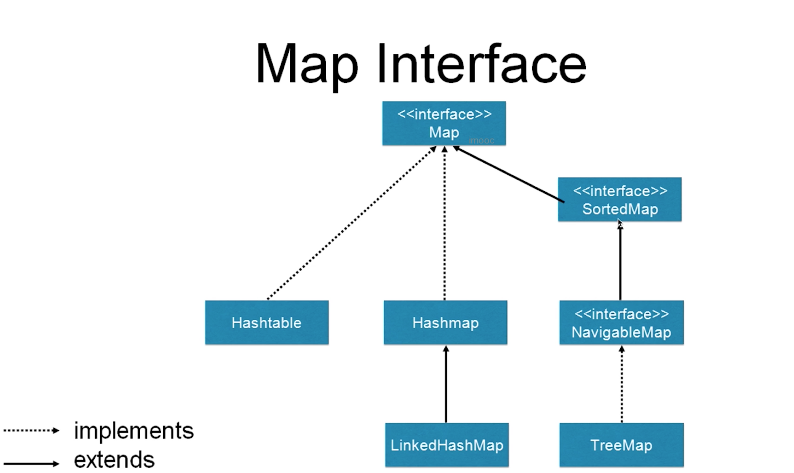

- 为什么需要ConcurrentHashMap

  - 为什么不用Collections.synchronizedMap()
  - 为什么HashMap是线程不安全的
    - 同时put碰撞导致数据丢失
    - 同时put扩容导致数据丢失
    - 死循环造成的cpu 100%
      - 主要存在于java7中
        - 调试技巧：修改jdk版本
        - 调试技巧：多线程配合，模拟真实场景
        
      - 代码演示
      
        - 如果被问到，可以和面试官稍微说下
      
          ```java
          import java.util.HashMap;
          
          /**
           * 演示HashMap在多线程情况下造成的死循环问题
           * 详细说明地址：https://coolshell.cn/articles/9606.html
           * 概念性的结论：多线程扩容的时候可能会导致循环链表，导致cpu 100%占用
           */
          public class HashMapEndlessLoop {
              private static HashMap<Integer,String> map = new HashMap<Integer,String>(2,1.5f);
          
              public static void main(String[] args) {
                  map.put(5,"C");
                  map.put(7,"B");
                  map.put(3,"A");
                  new Thread(new Runnable() {
                      @Override
                      public void run() {
                          map.put(15,"D");
                          System.out.println(map);
                      }
                  },"Thread-1").start();
          
                  new Thread(new Runnable() {
                      @Override
                      public void run() {
                          map.put(1,"E");
                          System.out.println(map);
                      }
                  },"Thread-2").start();
              }
          
          }
          
          ```
      
          

- HashMap进行分析

  - hashmap关于并发的特点

    - 非线程安全
    - 迭代时不准许修改内容
    - 只读的并发是安全的
    - 可以用Collections.synchronizedMap()的方式保证线程安全，但是效率会比较低

  - Jdk1.7 ConcurrentHashMap的实现和源码分析

    - 数组 + 链表的形式

    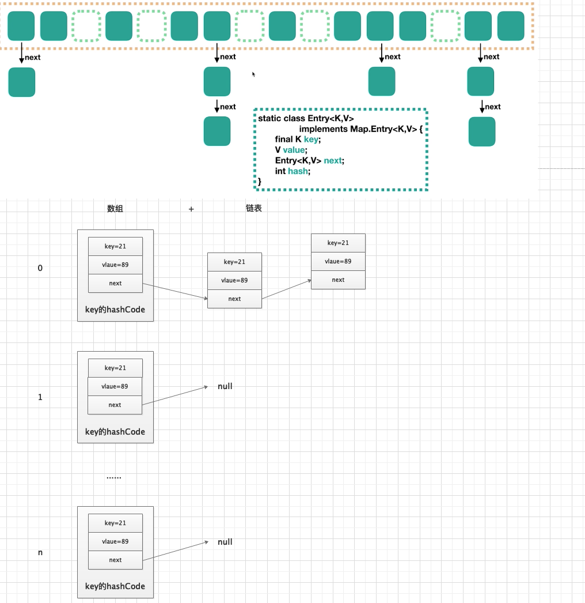 

  - jdk1.8 ConcurrentHashMap的实现和源码分析

    - 数组 + 链表 + 红黑树 【hash值重复的大于8之后就会变成红黑树】

      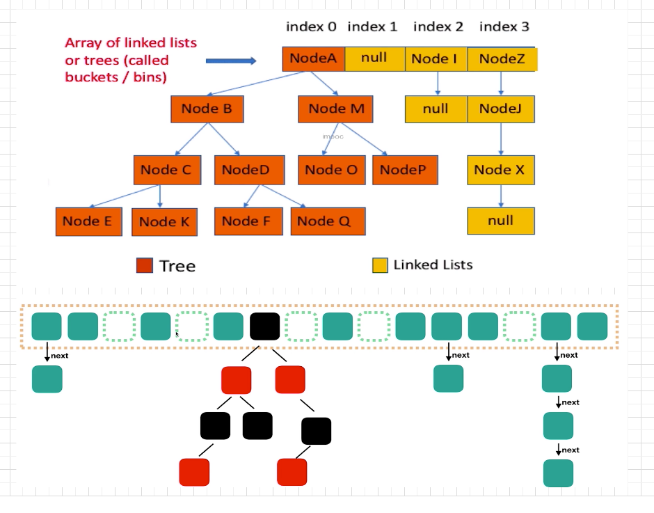

    - 红黑树

      - 只有红色和黑色，根节点是黑色，是一个二叉查找树，具有平衡性
      - 红色节点不能连续，红色节点的孩子和父亲都不能是红色节点
      - 从任一节点到其子树中每个叶子节点的路径都包含相同数量的黑色节点
      - 所有的叶子节点都是黑色的

- ConcurrentHashMap 在1.7和1.8中的结构分析

  - jdk1.7 特点

    - 最外层加入了segment，每个segment的底层数据结构与HashMap类似，任然是数组和链表组成的拉链法
    - 每个segment独立上ReentrantLock锁，每个segment之间互不影响，提高了并发效率
    - 默认ConcurrentHashMap默认有16个Segments，所以最多可以同时支持16个线程并发（操作分别分布在不同的Segment上）。这个默认值可以在初始化的时候设置为其他值，但是一旦初始化以后，是不可以扩容的

  - Jdk1.7结构图

    - 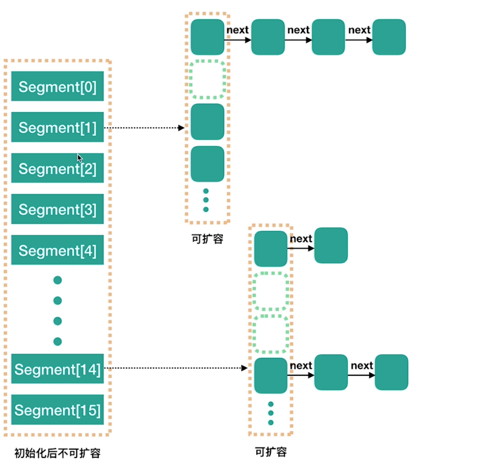
    - 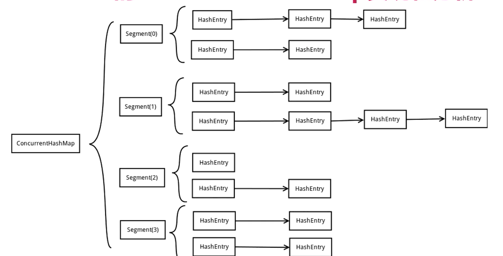

  - jdk1.8简介

    - 采用了cas + synchronized 的方式保证并发安全，而且不是segment，而是Node的方式

  - jdk1.8的结构

    - 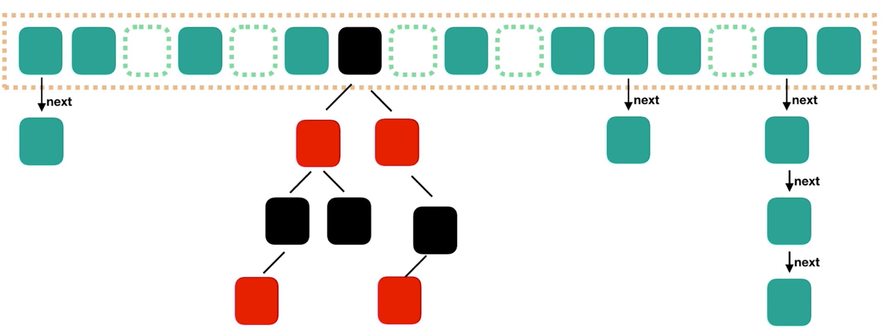

  - jdk1.8的常用方法

    - put方法不准许null key和null value

      > putVal流程
      >
      > - 判断key和value不为空
      > - 计算hash值
      > - 根据对应位置节点的类型，来赋值，或者helpTransfer，或者增长链表，或者给红黑树增加节点
      > - 检查满足阀值就 “红黑化”
      > - 返回oldValue

    - get

      > get的流程
      >
      > - 计算hash值
      > - 找到对应的位置，根据情况进行
      > - 直接取值
      > - 红黑树查找值
      > - 遍历链表取值
      > - 返回查找结果

- 对比jdk1.7和jdk1.8的优缺点，为什么要把1.7的结构改为1.8的结构

  - 数据结构
  - hahs碰撞
  - 并发原理
    - 7 中 使用segment保证
    - 8 中 使用cas + synchronized
  - 查询复杂度
    - 7 是 o(n) 8 是o(logn) 
    - 为什么是8 被转成红黑树
      - 链表的结构占用的内存空间更小
      - hash冲突达到8 是很难得 千万分之六，如果真是达到了8 说明需要改进hash算法

- 组合操作：ConcurrentHashMap也不是线程安全的？

  - 因为错误的使用

    ```java
    package collections.concurrenthashmap;
    
    import java.util.concurrent.ConcurrentHashMap;
    
    /**
     * 组合操作并不保证线程安全
     */
    public class OptionsNotSafe implements Runnable{
    
        private static  ConcurrentHashMap<String,Integer> scores = new ConcurrentHashMap<String,Integer>();
    
    
        public static void main(String[] args) throws InterruptedException {
            scores.put("小明",0);
            OptionsNotSafe r = new OptionsNotSafe();
            Thread t1 = new Thread(r);
            Thread t2 = new Thread(r);
            t1.start();
            t2.start();
            t1.join();
            t2.join();
            System.out.println(scores);
        }
    
        @Override
        public void run() {
            for (int i = 0; i < 1000; i++) {
                // get和put组合操作不是线程安全的,如果使用synchronized有不建议
    //            synchronized (OptionsNotSafe.class) {
    //                Integer score = scores.get("小明");
    //                Integer newScore = score + 1;
    //                scores.put("小明",newScore);
    //            }
    
                // 可以用replace方法替代
                while (true) {
                    Integer score = scores.get("小明");
                    Integer newScore = score + 1;
                    boolean b = scores.replace("小明", score, newScore);
                    if (b) {
                        break;
                    }
                }
            }
        }
    }
    
    ```

  - 其他替代组合方式

    - replace
    - putIfAbsent
      - 如果key有值，那么久返回值，没有值put值

- 实际案例分享

  - 租车系统司机出车前需要考试，乱序发放题目


### CopyOnWriteArrayList

- 诞生的历史和原因
  - 代替Vector和SynchronizedList
  - Vector和SynchronizedList锁的粒度大，效率不好
  - 还有CopyOnWriteArraySet可以替换set
  
- 适用场景
  - 读操作可以尽可能地快，而写慢一些也没关系
    - 读多写少
      - 黑名单、白名单：每日更新但是读取频繁
      - 监听器：迭代操作远多于修改操作
  
- 读写规则
  
  - 读取不加锁，写入的时候都可以读取，只有写写才会进行同步等待
  
- 实现原理

  - 修改会复制一份进行修改，然后将原来的引用指向修改后的集合

  - 可以实现读写分离

  - 原数据是不变的

  - 迭代可能出现脏读

    ```java
    package collections.copyonwrite;
    
    import java.util.Iterator;
    import java.util.concurrent.CopyOnWriteArrayList;
    
    public class CopyOnWriteArrayListDemo2 {
    
        public static void main(String[] args) {
            CopyOnWriteArrayList<Integer> integers = new CopyOnWriteArrayList<>(new Integer[]{1, 2, 3});
            System.out.println(integers);
            Iterator<Integer> itr1 = integers.iterator();
            integers.add(4);
            System.out.println(integers);
            Iterator<Integer> itr2 = integers.iterator();
            itr1.forEachRemaining(System.out::println);
            itr2.forEachRemaining(System.out::println);
        }
    }
    
    ```

    

- 缺点

  - 数据一致性问题：只保证最终一致性
  - 内存占用的问题：每次都会复制，内存占用会变大

- 源码分析

  - 数据结构：数组
  - 使用了锁：ReentrantLock，写加锁，读不加锁

### 并发队列

- 为什么要使用队列

  - 可以在线程中传递数据，生产者和消费者模式、银行转账
  - 如果队列的线程是安全的，线程安全问题就委托给队列解决了

- 并发队列简介

  - Queue
  - BlockingQueue

- 各个并发队列的关系图

  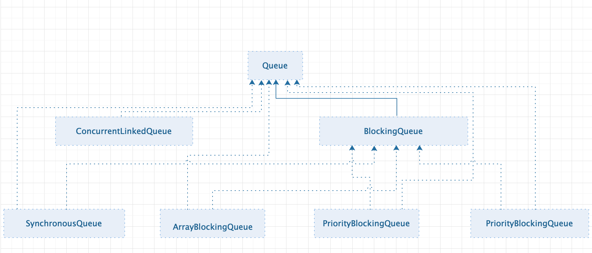

- 阻塞队列 - BlokingQueue

  - 简介

    - 有阻塞功能的队列，一端给生产者用，一端给消费者用，是线程安全的，所有生产者和消费者可以是多线程的，take()获取并移除队列的头结点，一但如果执行take的时候，队列里无数据，则阻塞，直到队列里有数据，put() 方法，插入元素，但是如果对了已满，则阻塞，直到队列里有空闲空间了。
    - 是否有界，如果是无界，最大可以容纳Integer.MAX_VALUE个元素，2^31，已经是无限大了
    - 阻塞队列和线程池之间的关系

  - 常用方法

    - put、take

      > take：从队首取出元素，如果队列为空，则阻塞
      >
      > put：从队尾放入元素，如果队列满了，则阻塞

    - add、remove、element

      > add： 如果队列满了会抛出异常
      >
      > remove：空了删除也会报异常
      >
      > element：返回队列的头元素，队列空，也抛出异常

    - offer、poll、peek

      > offer：添加元素，如果满了返回false
      >
      > poll：取出元素并删除，如果空了，返回null
      >
      > peek：取出不删除元素，如果空了，范湖null

  - 常见的阻塞队列

    - ArrayBlockingQueue
      - 有界，创建的时候指定大小
      - 公平：可以指定是否保证公平，如果想保证公平的话，那么等待了最长时间的线程会优先处理，不过这会代理性能的损耗，默认是不公平的
      - 使用案例
    - LinkedBlockingQueue
      - 无界，底层是linked，容量是无限大
      - 有两把锁，take 和put 是分别使用
    - PriorityBlockingQueue
      - 支持优先级
      - 自然顺序（而不是先进先出）
      - 无界队列，自动扩容
      - PriorityQueue 线程安全的版本
    - SynchronousQueue
      - 容量为0
      - 直接传递
      - 效率高
      - 没有peek函数
      - newCacheThreadPool 使用了这个队列
    - DelayQueue
      - 延迟队列，根据延时时间排序
      - 元素必须实现Delay接口，规定排序规则

    

- 非阻塞队列
  - ConcurrentLinkedQueue
    - 使用CAS非阻塞算法来实现线程安全
    - offer方法采用了cas的原理
- 如何选择适合自己队列
  - 是否需要有界
  - 空间
  - 吞吐量

### 总结


## 如何控制并发流程

### 什么是控制并发流程

> 让线程之间进行合作，来满足业务逻辑。比如让线程A等待线程B执行完再执行等

- 并发工具类概览

  | 类             | 作用                                                         | 说明                                                         |
  | -------------- | ------------------------------------------------------------ | ------------------------------------------------------------ |
  | Semaphore      | 信号量，可以通过控制“许可证”的数量，<br />来保证线程之间的配合 | 线程只有在拿到许可证后才能继续运行，<br />相比于其他的同步器，更灵活 |
  | CyclicBarrier  | 线程会等待，知道足够多线程达到了事先规定的数目，一旦达到触发条件，就可以进行下一步动作 | 使用于线程之间相互等待处理结果就绪的场景                     |
  | Phaser         | 和CyclicBarrier类似，但是计数器可变                          | java7加入                                                    |
  | CountDownLatch | 和CyclicBarrier类似，数量递减到0师，触发动作                 | 不可重复使用                                                 |
  | Exchanger      | 让两个线程在合适的时候交换对象                               | 适用场景：当两个线程工作在同一个类的不同实例上时，用于交换数据 |
  | Condition      | 可以控制线程的等待和唤醒                                     | 是Object.wait的升级版                                        |

  

### CountDownLatch - 倒计时门闩

- CountDownLatch 类的作用

  - 倒数门闩

  - 例子：购物拼团，过山车的时候需要凑齐一车人再发车

  - 流程：倒数结束之前，一直处于等待状态，知道倒计时结束了，此线程才继续开始工作

  - 主要方法

    - 构造方法 CountDownLatch(int count )：参数为需要倒数的数值
    - await(): 调用await方法的线程会被挂起，它会等待直到count值为0的时才继续执行
    - countDown()：将count值减一，直到为0，等待的线程会被唤醒

  - 图示

    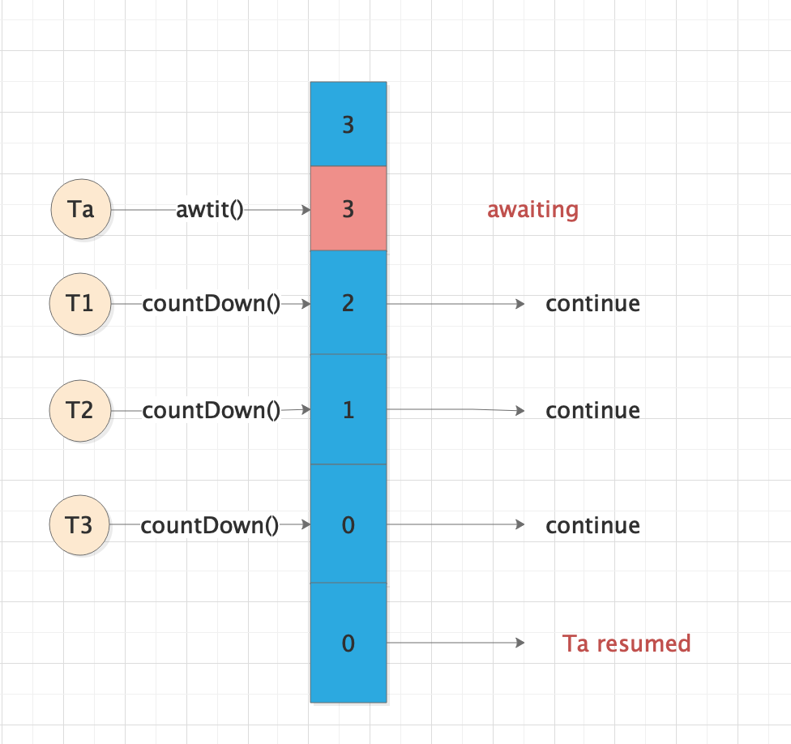

- 两个典型的用法

  - 用法一：一个线程等待，其他线程countDown

    ```java
    package flowControl.countdownlatch;
    
    import java.util.concurrent.CountDownLatch;
    import java.util.concurrent.ExecutorService;
    import java.util.concurrent.Executors;
    
    /**
     *  工厂中，质检，5个检查人员都检查通过了，才能认为是否通过
     */
    public class CountDownLatchDemo1 {
    
        public static void main(String[] args) throws InterruptedException {
            CountDownLatch countDownLatch = new CountDownLatch(5);
    
            ExecutorService executorService = Executors.newFixedThreadPool(5);
    
            for (int i = 0; i < 5; i++) {
                final int num = i + 1;
                Runnable runnable = new Runnable() {
                    @Override
                    public void run() {
                        try {
                            Thread.sleep((long) (Math.random() * 10000));
                            System.out.println("No." + num + "检查完了");
                        } catch (InterruptedException e) {
                            e.printStackTrace();
                        } finally {
                            countDownLatch.countDown();
                        }
                    }
                };
                executorService.submit(runnable);
            }
            System.out.println("等待5个人检查完.......");
    
            countDownLatch.await();
    
            System.out.println("所有人都检查完了，可以出厂了");
    
            executorService.shutdown();
    
    
        }
    }
    
    ```

  - 用法二：多个线程等待一个线程，服务器进行压力测试，尽量在同一时间发送请求

    ```java
    package flowControl.countdownlatch;
    
    import java.util.concurrent.CountDownLatch;
    import java.util.concurrent.ExecutorService;
    import java.util.concurrent.Executors;
    
    /**
     * 模拟跑步比赛
     */
    public class CountDownLatchDemo2 {
    
        public static void main(String[] args) throws InterruptedException {
            // 裁判的枪
            CountDownLatch begin = new CountDownLatch(1);
            ExecutorService executorService = Executors.newFixedThreadPool(5);
            for (int i = 0; i < 5; i++) {
                final int no = i + 1;
                Runnable runnable = new Runnable() {
                    @Override
                    public void run() {
                        System.out.println("No." + no + "准备完毕，等待发令枪");
                        try {
                            begin.await();
                            System.out.println("No." + no + "开始跑步");
                        } catch (InterruptedException e) {
                            e.printStackTrace();
                        }
                    }
                };
    
                executorService.submit(runnable);
    
            }
    
            Thread.sleep(5000);
            System.out.println("发令枪响起，比赛开始！");
            begin.countDown();
        }
    }
    
    ```

  - 综合以上两种方法：完整的跑步比赛，开始的裁判和终点的裁判

    ```java
    package flowControl.countdownlatch;
    
    import java.util.concurrent.CountDownLatch;
    import java.util.concurrent.ExecutorService;
    import java.util.concurrent.Executors;
    
    /**
     * 模拟跑步比赛 。开始的时候运动员等待裁判的发令枪，到达重点店的时候裁判等待运动员告知我已经跑完了
     *
     */
    public class CountDownLatchDemo1And2 {
    
        public static void main(String[] args) throws InterruptedException {
            // 裁判的枪
            CountDownLatch begin = new CountDownLatch(1);
            CountDownLatch end = new CountDownLatch(5);
            ExecutorService executorService = Executors.newFixedThreadPool(5);
            for (int i = 0; i < 5; i++) {
                final int no = i + 1;
                Runnable runnable = new Runnable() {
                    @Override
                    public void run() {
                        System.out.println("No." + no + "准备完毕，等待发令枪");
                        try {
                            begin.await();
                            System.out.println("No." + no + "开始跑步");
                            Thread.sleep((long)(Math.random()*10000));
                            System.out.println("No." + no + "跑到终点了");
                        } catch (InterruptedException e) {
                            e.printStackTrace();
                        } finally {
                            end.countDown();
                        }
                    }
                };
    
                executorService.submit(runnable);
    
            }
    
            Thread.sleep(5000);
            System.out.println("发令枪响起，比赛开始！");
            begin.countDown();
    
            end.await();
            System.out.println("所有人到达终点，比赛结束");
            executorService.shutdown();
            
        }
    }
    
    ```

- 注意点

  - 扩展用法：多等多
  - CountDownLatch不能重用，可以考虑CyclicBarrier

- 总结：

  - 一等多和多等一必须掌握
  - 不能回滚重置


### Semaphore - 信号量

> 有限资源的协调，比如现实生活中控制污染工厂的数量，每年只有3个工厂开放

- Semaphore的作用

  - 有限资源的协调，比如特别耗费时间的线程，我们可以控制它最大数量
  - 使用流程
    - 初始化信号量并制定许可证的数量
    - 调用信号量的acquire()或acquireUninterruptibly()方法获取许可证
      - 如果获取不到就会阻塞，获取到可以执行
    - 调用完了，调用release()释放许可证
  - 重要方法
    - 构造方法
      - new Semaphore(int premits)
      - new Semaphore(int permits,boolean fair) : 第二个参数为是否公平，如果传入true，那么Semaphore会把之前等待的线程放到FIFO队列里，以便于当有新的许可证了，可以分给之前等待时间较长的线程
    - acquire() 可以响应中断
    - acquireUninterruptibly() 不可响应中断
    - tryAcquire()：返回是否拿到许可证，拿不到可以不进入阻塞
    - tryAcquire(long tiemout)：给个等待时间
    - release()：记得一定要调用

- 代码演示

  - 一般用法

    ```java
    package flowControl.semaphore;
    
    import javax.swing.table.TableRowSorter;
    import java.util.concurrent.ExecutorService;
    import java.util.concurrent.Executors;
    import java.util.concurrent.Semaphore;
    
    /**
     * 一般用法
     */
    public class SemaphoreDemo {
    
        static Semaphore semaphore = new Semaphore(3,true);
    
        public static void main(String[] args) {
            ExecutorService executorService = Executors.newFixedThreadPool(50);
            for (int i = 0; i < 100; i++) {
                executorService.submit(new Task());
            }
        }
    
        static class Task implements Runnable {
            @Override
            public void run() {
                try {
                    semaphore.acquire();
                } catch (InterruptedException e) {
                    e.printStackTrace();
                }
                System.out.println(Thread.currentThread().getName() + "拿到了许可证");
    
                try {
                    Thread.sleep(2000);
                } catch (InterruptedException e) {
                    e.printStackTrace();
                }
                System.out.println(Thread.currentThread().getName() + "释放了许可证");
    
                semaphore.release();
            }
        }
    }
    
    ```

  - 特殊用法

    ```java
    package flowControl.semaphore;
    
    import javax.swing.table.TableRowSorter;
    import java.util.concurrent.ExecutorService;
    import java.util.concurrent.Executors;
    import java.util.concurrent.Semaphore;
    
    /**
     * 一般用法
     */
    public class SemaphoreDemo {
    
        static Semaphore semaphore = new Semaphore(3,true);
    
        public static void main(String[] args) {
            ExecutorService executorService = Executors.newFixedThreadPool(50);
            for (int i = 0; i < 100; i++) {
                executorService.submit(new Task());
            }
        }
    
        static class Task implements Runnable {
            @Override
            public void run() {
                try {
                    semaphore.acquire(3);
                } catch (InterruptedException e) {
                    e.printStackTrace();
                }
                System.out.println(Thread.currentThread().getName() + "拿到了许可证");
    
                try {
                    Thread.sleep(2000);
                } catch (InterruptedException e) {
                    e.printStackTrace();
                }
                System.out.println(Thread.currentThread().getName() + "释放了许可证");
    
                semaphore.release(3);
            }
        }
    }
    
    ```

    > 一次可以获取多个许可证，注意获取和释放的数量要保存一致，可能导致许可证丢失，导致程序卡死

- 注意点

  - 设置公平性，一般设置为公平
  - 获取和释放的许可证数量要一致
  - 释放和获取不要求同一个线程
  - 可以实现轻量级的CountDownLatch

### Condition 接口 - 条件对象

- 作用

  - 当线程1需要等待某个条件的时候，就去执行condition.await()方法，进入等待状态

  - 另外的线程2，去执行对应的条件，直到这个条件达成的时候，另外的线程2就会执行condition.signal()方法，这个时候jvm就会从被阻塞的线程里找，找到那些等待改condition的线程，线程1就会收到可执行信号，线程状态再次进入到Runnable状态

    > signalAll 和 signal的区别
    >
    > signalAll 会唤醒所有正在等待的线程
    >
    > signal 是公平的，只会唤醒等待时间最长的线程

- 代码演示

  - 普通的用法

    ```java
    package flowControl.condition;
    
    import java.util.concurrent.locks.Condition;
    import java.util.concurrent.locks.ReentrantLock;
    
    /**
     * 普通用法 绑定在锁上面
     */
    public class ConditionDemo1 {
    
        private ReentrantLock lock = new ReentrantLock();
    
        private Condition condition = lock.newCondition();
    
        void method1(){
            lock.lock();
    
            try {
                System.out.println("条件不满足，开始await");
    
                condition.await();
    
                System.out.println("条件满足了，开始执行后续任务");
    
            } catch (InterruptedException e) {
                e.printStackTrace();
            } finally {
                lock.unlock();
            }
        }
    
    
        void method2(){
            lock.lock();
    
            try {
                System.out.println("准备工作完成了，唤醒其他线程");
                condition.signal();
            } finally {
                lock.unlock();
            }
        }
    
    
        public static void main(String[] args) {
            ConditionDemo1 conditionDemo1 = new ConditionDemo1();
    
            Thread thread = new Thread(() -> {
                try {
                    Thread.sleep(1000);
                    conditionDemo1.method2();
                } catch (InterruptedException e) {
                    e.printStackTrace();
                }
            });
    
            thread.start();
    
            conditionDemo1.method1();
        }
    }
    
    ```

    

  - 实现生产者消费者模式

    ```java
    package flowControl.condition;
    
    import java.util.PriorityQueue;
    import java.util.concurrent.locks.Condition;
    import java.util.concurrent.locks.ReentrantLock;
    
    /**
     * Condition 实现生产者和消费者模式
     */
    public class ConditionDemo2 {
    
        private int queueSize = 10;
    
        private PriorityQueue<Integer> queue = new PriorityQueue<>(queueSize);
    
        private ReentrantLock lock = new ReentrantLock();
    
        private Condition notFull = lock.newCondition();
        private Condition notEmpty = lock.newCondition();
    
    
        public static void main(String[] args) {
            ConditionDemo2 conditionDemo2 = new ConditionDemo2();
            Producer producer = conditionDemo2.new Producer();
            Consumer consumer = conditionDemo2.new Consumer();
            producer.start();
            consumer.start();
        }
    
    
    
        class Consumer extends Thread {
    
            @Override
            public void run() {
                consume();
            }
    
            private void consume() {
                while (true) {
                    lock.lock();
                    try {
                        while (queue.size() == 0) {
                            System.out.println("队列空，等待数据生产");
                            try {
                                notEmpty.await();
                            } catch (InterruptedException e) {
                                e.printStackTrace();
                            }
                        }
    
                        queue.poll();
                        notFull.signalAll();
                        System.out.println("从队列中取出了一个元素，当前队列的大小为 " + queue.size());
    
                    } finally {
                        lock.unlock();
                    }
                }
            }
        }
    
    
        class Producer extends Thread {
    
            @Override
            public void run() {
                produce();
            }
    
            private void produce() {
                while (true) {
                    lock.lock();
                    try {
                        while (queue.size() == queueSize) {
                            System.out.println("队列满，等待数据消费");
                            try {
                                notFull.await();
                            } catch (InterruptedException e) {
                                e.printStackTrace();
                            }
                        }
                        queue.offer(1);
                        notEmpty.signalAll();
                        System.out.println("向队列中添加了一个元素，当前队列的剩余容量为： " + (queueSize - queue.size()));
                    }finally {
                        lock.unlock();
                    }
                }
            }
        }
    }
    
    ```

    

- 注意点

  - 和Object的wait/notify一样的使用方式
    - 必须在锁住的代码块里
    - await会释放持有的lock，和Object.wait一样，不需要手动释放锁
    - 调用await的时候，必须持有锁，否则会抛出异常


### CyclicBarrier - 循环栅栏

- 作用

  - 类似CountDownLatch ，都是阻塞一组线程
  - 当大量的线程相互配合，分别计算不同的任务，并且需要最后统一汇总的时候，我们可以使用CyclicBarrier，可以用来构造一个集结点，当一个线程执行完毕，它就会到集结点等待，直到所有的线程都到达了集结点，那么栅栏就被撤销，所有线程再统一出发，继续执行剩下的任务

- 代码演示

  ```java
  package flowControl.cyclicbarrier;
  
  import java.util.concurrent.BrokenBarrierException;
  import java.util.concurrent.CyclicBarrier;
  
  /**
   *
   */
  public class CyclicBarrierDemo {
  
      public static void main(String[] args) {
          CyclicBarrier cyclicBarrier = new CyclicBarrier(5, new Runnable() {
              @Override
              public void run() {
                  System.out.println("所有人都到齐了，大家一起出发");
              }
          });
  
          for (int i = 0; i < 10; i++) {
              new Thread(new Task(i,cyclicBarrier)).start();
          }
      }
  
      static class Task implements Runnable {
          private int id;
          private CyclicBarrier cyclicBarrier;
  
          public Task(int id,CyclicBarrier cyclicBarrier) {
              this.id = id;
              this.cyclicBarrier = cyclicBarrier;
          }
  
          @Override
          public void run() {
              System.out.println("线程" + id + "现在前往集合地点");
              try {
                  Thread.sleep((long)(Math.random()*10000));
                  System.out.println("线程" + id + "到达了集合地点，等待其他线程的到达");
                  cyclicBarrier.await();
                  System.out.println("线程" + id + "出发了");
  
              } catch (InterruptedException e) {
                  e.printStackTrace();
              } catch (BrokenBarrierException e) {
                  e.printStackTrace();
              }
          }
      }
  }
  
  ```

- 和CountDownLatch的不同

  - 作用不同：CyclicBarrier要等到固定数量的线程到达了栅栏才继续执行，而CountDownLatch只是等待数字到0，也就是说，CountDownLatch用于事件，而CyclicBarrier是用于线程的。
  - 可重用性不同：CountDownLatch不可重用
  - CyclicBarrier在都达到之后可以执行一个统一的任务


## AQS原理

- 学习AQS的思路

  - 在并发包中随处可见
  - 理解原理，提高技术，以及应对面试
  - 通常不需要自己实现AQS的工具类
  - 了解应用场景

- 为什么要AQS

  - 锁和协作类有共同点：闸门
    - 比如ReentrantLock和Semaphore
    - CountDownLatch、ReentrantReadWriteLock
  - 因为有共同点，所以我们需要提取功能类似的工具类，就出现了AQS
  - Semaphore和AQS的关系
    - Semaphore类有个内部类Sync类，Sync类继承了AQS类
    - 其实CountDownLatch、ReentrantLock也是一样的结构
  - AQS的比喻【HR和面试官】
    - 群面和单面
      - 群面：10个人一组，来10个人凑齐，就进行面试
      - 单面：1个人来就面试
      - 存在共同点：安排就做、叫号、先来后到等HR的工作就是AQS的工作
  - 如果没有AQS
    - 协作就需要自己实现
      - 同步状态的原子性
      - 线程的阻塞和解除阻塞
      - 队列的管理
      - ......
    - 有了AQS，我们就需要实现自己的业务

- AQS的作用

  - 用于构建锁、同步器、协作工具类，有了AQS以后，更多的协作工具类都可以方便的被写出来
  - 有了AQS，构建线程协作类就容易多了

- AQS的重要性和地位

  - AbstractQueueSynchronizer 是Doug Lea 编写的，从JDK1.5加入的一个基于FIFO等待队列实现的一个用于实现同步器的基础框架，有以下这些实现类：

    ​	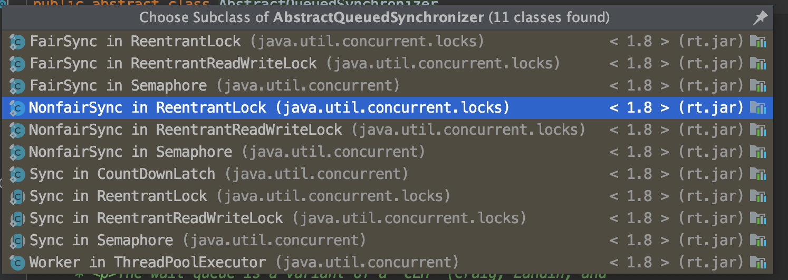

- **AQS的内部原理**

  - state 状态
    - 会根据具体的实现类有所不同，比如在Semaphore里，表示剩余的许可证数量，而在CountDownLatch里，表示还需要倒数的数量，在ReentrantLock，表示锁的占有情况，包括可重入计数
    - state是volatile修饰的int值，会被并发修改，所以所有修改state的方法必须保证线程安全，比如getState、setState以及compareAndSetState，这些都依赖j.u.c.atomic包的支持
  - 控制线程抢锁和配合的FIFO队列（先进先出）
    - 用来存放等待的线程，相当于排队管理器，双向链表的形式
  - 期望协作工具类去实现的获取/释放等重要方法
    - 获取和释放的方法，具体由实现类实现
      - 获取操作依赖state变量，经常会阻塞（比如获取不到锁的时候），再比如在Semaphore中是acquire，在CountDownLatch中是await
      - 释放方法，操作不会阻塞，具体也是实现类来实现

- 应用实例，源码解析

  - ·AQS的通常用法
    - 写一个类，想好协作的逻辑，实现获取/释放方法
    - 内部写一个Sync类继承AQS类
    - 根据是否独占来重写tryAcquire/tryRelease，如果是共享就实现tryAcquireShared(int acquires)和tryReleaseShared(int release)等方法，在之前写的获取/释放方法中调用AQS的acquire和release或者shared方法
  - AQS在CountDownLatch中的应用
    - 代用await方法会尝试获取共享锁，一开始获取不到该锁，于是线程进入阻塞
    - 而共享锁可获取的条件，就是state为0
    - 代用countDown才会改变state
  - AQS在Semaphore中的应用
    - state表示信号量的数量
  - AQS在ReetrantLock中的应用
    - tryRelease , 当前线程是否是持有锁的线程，是的话判断state，state代表重入的次数，减到0了，说明可以释放

- 用AQS实现自己的Latch【门闩】

  ```java
  package aqs;
  
  import java.util.concurrent.locks.AbstractQueuedSynchronizer;
  
  /**
   * 实现简单的门闩，利用AQS
   */
  public class OneShotLatch {
  
  
      private final Sync sync = new Sync();
  
      public void signal() {
          sync.releaseShared(0);
      }
  
      public void await(){
          sync.acquireShared(0);
      }
  
      private class Sync extends AbstractQueuedSynchronizer{
  
          @Override
          protected int tryAcquireShared(int arg) {
              return getState() == 1 ? 1 : -1;
          }
          @Override
          protected boolean tryReleaseShared(int arg) {
              setState(1);
              return true;
          }
      }
  
      public static void main(String[] args) throws InterruptedException {
          OneShotLatch oneShotLatch = new OneShotLatch();
          for (int i = 0; i < 10; i++) {
              new Thread(new Runnable() {
                  @Override
                  public void run() {
                      System.out.println(Thread.currentThread().getName() + "尝试获取Latch，获取失败就等待");
                      oneShotLatch.await();
                      System.out.println(Thread.currentThread().getName() + "放闸，继续执行");
                  }
              }).start();
          }
  
          Thread.sleep(5000);
          oneShotLatch.signal();
          new Thread(new Runnable() {
              @Override
              public void run() {
                  System.out.println(Thread.currentThread().getName() + "尝试获取Latch，获取失败就等待");
                  oneShotLatch.await();
                  System.out.println(Thread.currentThread().getName() + "放闸，继续执行");
              }
          }).start();
      }
  }
  
  
  ```

  

> AQS参考资料
>
> 美团技术团队《从ReentrantLock的实现看AQS的原理及应用》：https://mp.weixin.qq.com/s/sA01gxC4EbgypCsQt5pVog
> 老钱《打通 Java 任督二脉 —— 并发数据结构的基石》：https://juejin.im/post/5c11d6376fb9a049e82b6253
> HongJie《一行一行源码分析清楚AbstractQueuedSynchronizer》：https://javadoop.com/post/AbstractQueuedSynchronizer
> 爱吃鱼的KK《AbstractQueuedSynchronizer 源码分析 (基于Java 8)》：https://www.jianshu.com/p/e7659436538b
> waterystone《Java并发之AQS详解》：https://www.cnblogs.com/waterystone/p/4920797.html
> 英文论文的中文翻译：https://www.cnblogs.com/dennyzhangdd/p/7218510.html
> AQS作者的英文论文：http://gee.cs.oswego.edu/dl/papers/aqs.pdf


## Future 和Callable 治理线程的第二大法宝

### Runnable 的缺陷

- 缺陷
  - 不能返回一个返回值
  - 不能抛出一个 checked exception
- 为什么设计成这样
  - 处理异常的不是我们编写的，所有我们只能try catch
- 针对无法抛出异常的补救 - Callable

### Callable接口

- 类似Runnable，被其他线程执行的任务
- 实现call方法
-  有返回值


### Future类

- 作用
  - 执行耗时的方法，可以用子线程执行，主线程可以继续执行
- Future 和  Callable的关系
  - 可以用Future的get来获取Callable的执行结果
  - 还可以用Future的isDone方法来判断任务是否执行完成了，
  - 取消任务，限时获取任务的结果等
  - 当call方法未执行完毕之前，调用get方法的线程会阻塞，直到call方法有结果了，才会获取到结果，然后才会切换到Runnable状态
  - 其实Future就是一个存储器，它存储了call这个任务执行的结果，而这个任务的执行时间是无法提前确定的，取决于call方法的执行情况
- 主要方法
  - get方法：获取结果
    - 取决于Callable任务的状态，只有以下5种情况
      - 任务正常完成了：get立刻放回结果
      - 任务尚未完成：未开始或进行中，此时get将阻塞直到任务完成
      - 任务执行抛出了异常：get方法会抛出异常 ExecitionException，无论call方法抛出什么异常
      - 任务被取消：get方法抛出CanclelationException
      - 任务超时：get(long timeout,TimeUnit unit) 传入超时时间，如果还没有拿到结果就抛出TimeoutException，任务超时，需要取消任务 cancel方法
  - cancel方法：任务取消
  - isDone方法：判断线程任务是否执行完毕：成功执行，异常完毕
  - isCancel方法：判断线程任务是否被取消了

### Future用法1：线程池的submit方法返回Future对象

- get的基本用法

  > 给线程池提交任务，返回Future，此时会立即返回一个空的Future容器，当线程的任务一旦执行完毕，可以获取结果的时候，线程池便会把结果填入到之前给我我们的那个Future中去，而不是新建一个Future，此时就可以回去线程的执行结果了

  ```java
  package future;
  
  import java.util.Random;
  import java.util.concurrent.*;
  
  /**
   * 演示一个Future的使用方法
   */
  public class OneFuture {
  
      public static void main(String[] args) {
          ExecutorService executorService = Executors.newFixedThreadPool(10);
  
          Future<Integer> submit = executorService.submit(new CallableTask());
  
          try {
              System.out.println(submit.get());
          } catch (InterruptedException e) {
              e.printStackTrace();
          } catch (ExecutionException e) {
              e.printStackTrace();
          }
          executorService.shutdown();
      }
  
      static class CallableTask implements Callable<Integer> {
          @Override
          public Integer call() throws Exception {
              Thread.sleep(3000);
              return new Random().nextInt();
          }
      }
  }
  
  ```

- Callable的Lambda表达式形式

  ```java
  package future;
  
  import java.util.Random;
  import java.util.concurrent.*;
  
  /**
   * 演示一个Future的使用方法
   */
  public class OneFutureLambda {
  
      public static void main(String[] args) {
          ExecutorService executorService = Executors.newFixedThreadPool(10);
  
          Callable<Integer> callable = () -> {
              Thread.sleep(3000);
              return new Random().nextInt();
          };
          Future<Integer> submit = executorService.submit(callable);
  
          try {
              System.out.println(submit.get());
          } catch (InterruptedException e) {
              e.printStackTrace();
          } catch (ExecutionException e) {
              e.printStackTrace();
          }
          executorService.shutdown();
      }
  
  
  }
  
  ```

- 多个任务，用Future数组来获取结果

  ```java 
  package future;
  
  import java.util.ArrayList;
  import java.util.List;
  import java.util.Random;
  import java.util.concurrent.*;
  
  /**
   * 批量提交任务，用list批量接收结果
   */
  public class MultiFutures {
  
  
      public static void main(String[] args) {
          ExecutorService executorService = Executors.newFixedThreadPool(2);
  
          List<Future<Integer>> futures = new ArrayList<>();
          Callable<Integer> callable = () -> {
              Thread.sleep(3000);
              return new Random().nextInt();
          };
          for (int i = 0; i < 20; i++) {
              Future<Integer> future = executorService.submit(callable);
              futures.add(future);
          }
  
          for (int i = 0; i < 20; i++) {
              try {
                  Integer integer = futures.get(i).get();
                  System.out.println(integer);
              } catch (InterruptedException e) {
                  e.printStackTrace();
              } catch (ExecutionException e) {
                  e.printStackTrace();
              }
          }
      }
  
  }
  
  ```

- 抛出异常情况

  ```java
  package future;
  
  import com.sun.scenario.effect.impl.sw.sse.SSEBlend_SRC_OUTPeer;
  
  import java.util.Random;
  import java.util.concurrent.*;
  
  /**
   * get方法过程中抛出异常，执行get的时候才会抛出异常
   */
  public class GetException {
      public static void main(String[] args) {
          ExecutorService executorService = Executors.newFixedThreadPool(10);
  
          Future<Integer> submit = executorService.submit(new CallableTask());
  
          try {
              for (int i = 0; i < 5; i++) {
                  System.out.println(i);
                  Thread.sleep(500);
              }
  
              System.out.println(submit.isDone());
              submit.get();
          } catch (InterruptedException e) {
              e.printStackTrace();
              System.out.println("抛出InterruptedException");
          } catch (ExecutionException e) {
              e.printStackTrace();
              System.out.println("抛出ExecutionException");
  
          }
  
      }
  
      static class CallableTask implements Callable<Integer> {
          @Override
          public Integer call() throws Exception {
              throw new IllegalArgumentException("Callable抛出了异常");
          }
      }
  
  }
  
  ```

- get 超时方法，超时后需要处理线程

  ```java
  package future;
  
  import java.util.concurrent.*;
  
  /**
   * 演示get的超时方法，超时之后需要取消任务，cancel方法传入true和false的区别，表示是否中断正在执行的任务
   */
  public class Timeout {
  
      private static final Ad DEFAULT_AD = new Ad("无网络的时候的默认广告");
  
      private static final ExecutorService exec = Executors.newFixedThreadPool(10);
  
      static class Ad{
          String name;
          public Ad(String name) {
              this.name = name;
          }
          @Override
          public String toString() {
              return "Ad{" +
                      "name='" + name + '\'' +
                      '}';
          }
      }
  
      static class FetchAdTask implements Callable<Ad>{
  
          @Override
          public Ad call() throws Exception {
              try {
                  Thread.sleep(3000);
              } catch (InterruptedException e) {
                  System.out.println("sleep期间被中断了");
                  return new Ad("被中断时候的默认广告");
              }
              return new Ad("旅游订票哪家强？找携程");
          }
      }
  
      public void printAd(){
          Future<Ad> f = exec.submit(new FetchAdTask());
          Ad ad;
          try {
              ad = f.get(2000,TimeUnit.MILLISECONDS);
          } catch (InterruptedException e) {
              ad = new Ad("被中断的时候的默认广告");
              e.printStackTrace();
          } catch (ExecutionException e) {
              ad = new Ad("异常时候的默认广告");
              e.printStackTrace();
          } catch (TimeoutException e) {
              ad = new Ad("超时时候的默认广告");
              System.out.println("超时，未获取到广告");
              boolean cancel = f.cancel(true);
              System.out.println("cancel的结果，" + cancel);
  
          }
          exec.shutdown();
          System.out.println(ad);
      }
  
      public static void main(String[] args) {
          new Timeout().printAd();
      }
  }
  
  ```

- 任务取消

  - 如果还未开始就取消，任务就会正常被取消，返回true
  - 如果任务完成，或已取消，那么cancel方法会执行失败，返回false
  - 如果任务开始执行了，那么这个取消方法将不会直接取消该任务，而是根据我们传入的true和false参数来判断：
    - true 发送中断信号
    - false 任务不会中断信号 ？？？？
      - false 主要是针对未被开始的线程、不清楚任务是否支持取消
      - **ture 适用于任务中有响应中断的业务逻辑**

### Future用法2：FutureTask来创建Future

- FutureTask是一个包装器，可以吧Callable转换成Future和Runnable，它同时实现了二者的接口

  


- 代码

  ```java
  package future;
  
  import java.util.concurrent.*;
  
  /**
   * 演示FutureTask的用法
   */
  public class FutureTaskDemo {
  
      public static void main(String[] args) {
          Task task = new Task();
          FutureTask<Integer> integerFutureTask = new FutureTask<>(task);
  //        new Thread(integerFutureTask).start();
          ExecutorService executorService = Executors.newCachedThreadPool();
          executorService.submit(integerFutureTask);
          try {
              System.out.println(integerFutureTask.get());
          } catch (InterruptedException e) {
              e.printStackTrace();
          } catch (ExecutionException e) {
              e.printStackTrace();
          }
      }
  
  
  }
  class Task implements Callable<Integer> {
  
      @Override
      public Integer call() throws Exception {
          System.out.println("子线程正在计算");
          Thread.sleep(3000);
          int sum = 0;
          for (int i = 0; i<100; i++){
              sum+=i;
          }
          return sum;
      }
  }
  
  ```

  

### Future的注意点

- 任务执行的时间是不统一的，会造成阻塞
  - get的超时方法
  - 使用CompletableFuture来获取结果
- 生命周期是不能后退


